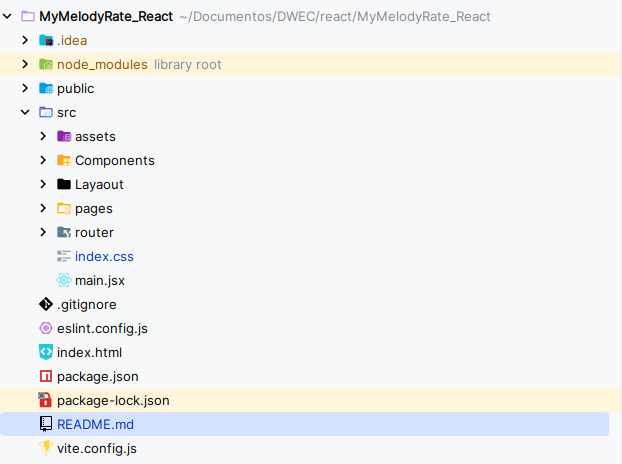
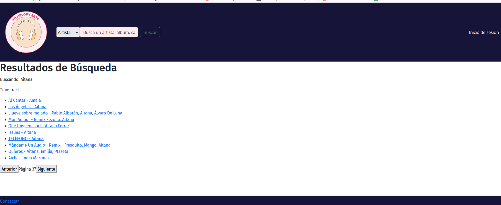

# MyMelodyRate_React


# Segunda entrega

## Estructura del proyecto

Para la creación de la estructura del proyecto me he basado en la misma que genera el propio vite y lo que hemos visto en
clase. Al final quedaría algo así  Que explicando un poco de manera organizada:

### Contenido de la raiz
* **Public**: Este directorio contiene el logo de la pestaña en la web
* **index.html**: Es el index de la página, necesario pero no será tocado durante el desarrollo
* **src**: Este directorio contiene todos los componentes, lógica, páginas que se usarán en el proyecto

### Contenido del src
* **assets**: Contiene las imágenes que se usarán en el proyecto.
* **Components**: Contiene los componentes que usaré en el proyecto, por ahora tengo 4 componentes. Sé que esta carpeta 
se puede hacer por cada página, pero decidí hacer una carpeta globar para evitar la sobreorganización del proyecto y porque
tampoco estaré usando muchos componentes
* **Layaout**: Contiene los layaouts que usaré en el proyecto
* **Pages**: Contiene las páginas que tendrá el proyecto, ahora hablaremos de ellas.
* **Router**: Contiene el fichero index.jsx que se encargará de hacer un enrutamiento dinámico de las páginas

## Creación de las páginas principales
Para la creación de las páginas principales me inspiré en mi proyecto de figma, lo revisé y me puse manos a la obra.
En el proyecto habrá un total de 10 páginas

## Enrutamiento de las páginas
Mediante el uso de react-router-dom, he aplicado el enrutamiento dinámico para este proyecto web. En él he puesto
Al momento de ponerme a enrutar, hice una carpeta router que contiene un archivo index.jsx. En ese archivo lo tengo de
la siguiente manera:

Una primera parte así:
```jsx
        path:"/",
        element:<LayaoutPublic/>,
        errorElement: <NotFound />,
        children:[
```
En esta parte dejo claro que la página inicia en la raíz y cargará el componente de LayaoutPublic y en caso de error 
cargará el componente de NotFound y luego estarían la segunda parte del código, los children:
```jsx
children:[
    {
        children:[
            {
                index:true,
                element: <Home />,
            },
            {
                path: "/artist",
                element: <Artista />,
            },
            {
                path: "/album",
                element: <Album />,
            },
            {
                path: "/track",
                element: <Cancion />,
            },
            {
                path: "/user",
                element:<Perfil />
            },
            {
                path: "/list", //TODO()considerar poner /list:id
                element: <Lista />,
            },
            {
                path: "/sign_in",
                element:<InicioDeSesion />
            },
            {
                path: "/sign_up",
                element:<Registro />
            },
            {
                path: "/contact_me",
                element:<Contactos />
            }
        ]
    }
]
```
Básicamente, indica el contenido de qué determinada ruta cargará el contenido del componente dentro del espacio del Outlet
del archivo main.jsx
## Formulario de contactos

Para realizar el formulario de contactos, el cual tiene 3 campos (nombre,email y mensaje) he usado tres estados para definirlos,
con sus respectivos handle ,que ahora enseñaré, para manejar la validación de sus mensajes. 
```jsx
const [name, setName] = React.useState('');
const [email, setEmail] = React.useState('');
const [message, setMessage] = React.useState('');
```

Para validarlos:
* En caso del nombre y el mensaje (solo se muestra el de nombre porque el de mensaje es igual) solamente valido que el mensaje
no sea un mensaje vacío
* En caso del email hago uso de un Regex que valida que el formato del email sea el adecuado
Como se puede ver, si ambos pasan el requisito cambian el valor de los estados

```jsx
const handleNameBlur = (e) => {
        const nombre = e.target.value;
        if (nombre.trim().length > 0) {
            setName(nombre);
        } else {
            console.log("Por favor, ingrese un nombre."); //TODO(cambiar por una función que lo pinte)
        }
    };

const handleEmailBlur = (e) => {
        const correo = e.target.value;
        const emailRegex = /^[\w-\.]+@([\w-]+\.)+[\w-]{2,4}$/;
        if (emailRegex.test(correo)) {
            setEmail(correo);
        } else {
            console.log("Por favor, ingrese un email válido.");//TODO(cambiar por una función que lo pinte)
        }
    };
```
# Tercera entrega

## Demostración del funcionamiento de las funcionalidades asíncronas:

```js
export const hacerSolicitud = async (urlPeticion) => {
    await verificarToken(); // Asegura que el token sea válido
    try {
        const response = await axios.get(urlPeticion, {
            headers: { Authorization: `Bearer ${accessToken}` }
        });
        return response.data; // Devuelve los datos de la API
    } catch (error) {
        console.error('Error al hacer la solicitud:', error.response?.data || error.message);
        throw error; // Lanza el error para que sea manejado donde se llame
    }
};
```

```js
export const resultadosBusqueda = async ({ query, type, limit = 25, offset = 0 }) => {
    try {
        return await hacerSolicitud(`https://api.spotify.com/v1/search?q=${query}&type=${type}&market=ES&limit=${limit}&offset=${offset}`);
    } catch (error) {
        console.error("Error al obtener las canciones");
        throw error;
    }
};
```


## Implementaciones nuevas

### Formulario de Login y Registro implementados, validados y funcionales.
Para los formularios de Login y Registro hice un par de formularios con sus respectivas validaciones nada que destacar.
Solo comentar que se añadieron las implementaciones con Firebase, de tal manera que cuando rellenas el formulario de 
registro se creará una nueva cuenta y cuando inicies sesión pues estarás usando esa cuenta.

Este es todo el código de Firebase:
```js
const app = initializeApp(firebaseConfig);

export const auth = getAuth(app);

export const login = ({email,password}) => {
    return signInWithEmailAndPassword(auth,email,password);
}

export const register = ({email, password}) => {
    return createUserWithEmailAndPassword(auth,email,password);
}

export const logOut =  () => signOut(auth)
```


### Integración de API con comunicación asíncrona en la aplicación (al menos una vista que consuma datos de la API).
Mi historia con la API en este proyecto ha sido curiosa, cambié la api a la de Spotify por temas de imagenes que otorgaba
la api de lastfm. Como la API de spotify requería de token hice un archivo en la carpeta config para todo el asunto del
token y para hacerme un método que simplemente le pasas la url de la petición API y ya se encarga de hacerla 

```js
export const hacerSolicitud = async (urlPeticion) => {
    await verificarToken(); // Asegura que el token sea válido
    try {
        const response = await axios.get(urlPeticion, {
            headers: { Authorization: `Bearer ${accessToken}` }
        });
        return response.data; // Devuelve los datos de la API
    } catch (error) {
        console.error('Error al hacer la solicitud:', error.response?.data || error.message);
        throw error; // Lanza el error para que sea manejado donde se llame
    }
};
```
En lo personal me hice esta función para ahorrarme líneas de código repetido. Y aquí un bloque de código en el que se
consume datos de la API:
```js
const getNewAlbums = async () => {
    try {
        return await hacerSolicitud("https://api.spotify.com/v1/browse/new-releases?limit=5");
    } catch (error) {
        // setError(error);
        console.error("Error al obtener nuevos álbumes:", error);
        throw error; // Vuelve a lanzar el error si necesitas manejarlo aguas arriba
    }
};
```

### Paginación de la galería principal de la aplicación.
Respecto la paginación, fue un poco dificil de pensar cómo hacerlo. Pero estuve viendo que la API de Spotify se le podía
hacer una petición de búsqueda con la que tener resultados que paginar (también aporta facilidades para paginar).

Hice que los resultados de la barra de búsqueda del header se pasasen por parámetros en la url en la página de resultados
y con lo siguiente, recogí esos datos enviados desde cualquier parte de la web hacía la página de resultados:
```js
// Parámetros de búsqueda
    const location = useLocation();

    const queryParams = new URLSearchParams(location.search);
    const query = queryParams.get('query');
    const type = queryParams.get('type');
```

Luego usé esta función para hacer la petición:
```js
export const resultadosBusqueda = async ({ query, type, limit = 25, offset = 0 }) => {
    try {
        return await hacerSolicitud(`https://api.spotify.com/v1/search?q=${query}&type=${type}&market=ES&limit=${limit}&offset=${offset}`);
    } catch (error) {
        console.error("Error al obtener las canciones");
        throw error;
    }
};
```
Le paso los resultados por page máximos como parámetro, a parte de pasarle el texto de la búsqueda y el tipo de dato
que estás buscando. También el offet. El resultado el siguiente que se puede apreciar en esta imagen:

### Aplicación completamente enrutada, incluyendo layouts cuando sea necesario, y usando lazyload.
La aplicación está totalmente enrutada como se puede ver en el router/index.js. Se hizo uso de un LayaoutPublico para 
todas aquellas páginas que no requiriesen de una autenticación y para el resto usé un LayoautPrivado.

Respecto al lazyload, puse todas las páginas menos el home porque consideré que si no eran necesario que estuviesen
cargadas en todo momento, ya cargarán cuando el usuario acceda a ellos
```js
const NotFound = lazy(() => import("../pages/NotFound.jsx"));
const Artista = lazy(() => import("../pages/Artista.jsx"));
const Album = lazy(() => import("../pages/Album.jsx"));
const Cancion = lazy(() => import("../pages/Cancion.jsx"));
const Perfil = lazy(() => import("../pages/Perfil.jsx"));
const Lista = lazy(() => import("../pages/Lista.jsx"));
const InicioDeSesion = lazy(() => import("../pages/InicioDeSesion.jsx"));
const Registro = lazy(() => import("../pages/Registro.jsx"));
const Contactos = lazy(() => import("../pages/Contactos.jsx"));
```
### Implementación de protección de rutas y vistas (utilizando React Router).
He implementado la protección de rutas en aquellas páginas que requieren una autenticación previa, por ejemplo en tu perfil
si no has iniciado sesión o en una lista tuya.
```js
const {user} = useContext(UserContext);
const navigate = useNavigate();

useEffect(() => {
    !user && navigate('/login');
},[user])
```
Cuando inicias sesión con tu cuenta, eso cambia un estado global que controla el estado de la cuenta.
Si accedes a tu perfil sin iniciar sesión pues cuando intente cargar la página y vea que el estado globar user no está
pues te dirigirá a login para que inicies sesión.