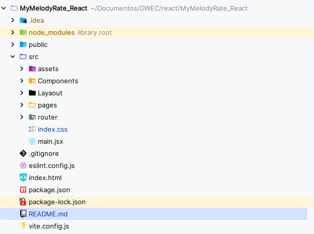

# MyMelodyRate_React


# Segunda entrega

## Estructura del proyecto

Para la creación de la estructura del proyecto me he basado en la misma que genera el propio vite y lo que hemos visto en
clase. Al final quedaría algo así  Que explicando un poco de manera organizada:

### Contenido de la raiz
* **Public**: Este directorio contiene el logo de la pestaña en la web
* **index.html**: Es el index de la página, necesario pero no será tocado durante el desarrollo
* **src**: Este directorio contiene todos los componentes, lógica, páginas que se usarán en el proyecto

### Contenido del src
* **assets**: Contiene las imágenes que se usarán en el proyecto.
* **Components**: Contiene los componentes que usaré en el proyecto, por ahora tengo 4 componentes. Sé que esta carpeta 
se puede hacer por cada página, pero decidí hacer una carpeta globar para evitar la sobreorganización del proyecto y porque
tampoco estaré usando muchos componentes
* **Layaout**: Contiene los layaouts que usaré en el proyecto
* **Pages**: Contiene las páginas que tendrá el proyecto, ahora hablaremos de ellas.
* **Router**: Contiene el fichero index.jsx que se encargará de hacer un enrutamiento dinámico de las páginas

## Creación de las páginas principales
Para la creación de las páginas principales me inspiré en mi proyecto de figma, lo revisé y me puse manos a la obra.
En el proyecto habrá un total de 10 páginas

## Enrutamiento de las páginas
Mediante el uso de react-router-dom, he aplicado el enrutamiento dinámico para este proyecto web. En él he puesto
Al momento de ponerme a enrutar, hice una carpeta router que contiene un archivo index.jsx. En ese archivo lo tengo de
la siguiente manera:

Una primera parte así:
```jsx
        path:"/",
        element:<LayaoutPublic/>,
        errorElement: <NotFound />,
        children:[
```
En esta parte dejo claro que la página inicia en la raíz y cargará el componente de LayaoutPublic y en caso de error 
cargará el componente de NotFound y luego estarían la segunda parte del código, los children:
```jsx
children:[
    {
        children:[
            {
                index:true,
                element: <Home />,
            },
            {
                path: "/artist",
                element: <Artista />,
            },
            {
                path: "/album",
                element: <Album />,
            },
            {
                path: "/track",
                element: <Cancion />,
            },
            {
                path: "/user",
                element:<Perfil />
            },
            {
                path: "/list", //TODO()considerar poner /list:id
                element: <Lista />,
            },
            {
                path: "/sign_in",
                element:<InicioDeSesion />
            },
            {
                path: "/sign_up",
                element:<Registro />
            },
            {
                path: "/contact_me",
                element:<Contactos />
            }
        ]
    }
]
```
Básicamente, indica el contenido de qué determinada ruta cargará el contenido del componente dentro del espacio del Outlet
del archivo main.jsx
## Formulario de contactos

Para realizar el formulario de contactos, el cual tiene 3 campos (nombre,email y mensaje) he usado tres estados para definirlos,
con sus respectivos handle ,que ahora enseñaré, para manejar la validación de sus mensajes. 
```jsx
const [name, setName] = React.useState('');
const [email, setEmail] = React.useState('');
const [message, setMessage] = React.useState('');
```

Para validarlos:
* En caso del nombre y el mensaje (solo se muestra el de nombre porque el de mensaje es igual) solamente valido que el mensaje
no sea un mensaje vacío
* En caso del email hago uso de un Regex que valida que el formato del email sea el adecuado
Como se puede ver, si ambos pasan el requisito cambian el valor de los estados

```jsx
const handleNameBlur = (e) => {
        const nombre = e.target.value;
        if (nombre.trim().length > 0) {
            setName(nombre);
        } else {
            console.log("Por favor, ingrese un nombre."); //TODO(cambiar por una función que lo pinte)
        }
    };

const handleEmailBlur = (e) => {
        const correo = e.target.value;
        const emailRegex = /^[\w-\.]+@([\w-]+\.)+[\w-]{2,4}$/;
        if (emailRegex.test(correo)) {
            setEmail(correo);
        } else {
            console.log("Por favor, ingrese un email válido.");//TODO(cambiar por una función que lo pinte)
        }
    };
```